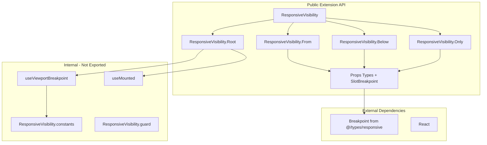

# ResponsiveVisibility — Extension API Specification

**Package:** `@tenerife.music/ui`  
**Layer:** Extension / Composition  
**Phase:** L.2 — Extension API Design  
**Status:** STABLE (after Phase L.3 implementation)  
**Date Created:** 2026-02-01  
**Task ID:** TUI_PHASE_L2_RESPONSIVE_VISIBILITY_API_DESIGN_001

---

## Document Classification

**TYPE:** Extension API Specification — implementation-ready reference for ResponsiveVisibility.  
**MUTABILITY:** API is stable; changes require new CANON / Phase L audit.  
**AUTHORITY:** [RESPONSIVE_VISIBILITY_CANON.md](RESPONSIVE_VISIBILITY_CANON.md), [RESPONSIVE_VISIBILITY_LOCK.md](../locks/RESPONSIVE_VISIBILITY_LOCK.md)

**Purpose:** This document formalizes the Extension API surface for ResponsiveVisibility. It complements the CANON with an implementation-ready specification. No implementation code; API changes require Phase L / CANON audit and unlock procedure per LOCK.

---

## Public Components (Final Names)

| Component | Access | Role |
|-----------|--------|------|
| Root | `ResponsiveVisibility.Root` | Wrapper that evaluates slot children and renders at most one matching slot |
| From | `ResponsiveVisibility.From` | Slot visible when viewport ≥ breakpoint |
| Below | `ResponsiveVisibility.Below` | Slot visible when viewport < breakpoint |
| Only | `ResponsiveVisibility.Only` | Slot visible when viewport in [bp, nextBp); Only(2xl) = From(2xl) |

---

## Props & Constraints

| Component | Props | Allowed values | Notes |
|-----------|-------|----------------|-------|
| Root | `children?: ReactNode` | — | No `className` or `style` |
| From | `bp: SlotBreakpoint`, `children?: ReactNode` | `sm` \| `md` \| `lg` \| `xl` \| `2xl` | `bp` required |
| Below | `bp: SlotBreakpoint`, `children?: ReactNode` | `sm` \| `md` \| `lg` \| `xl` \| `2xl` | `bp` required |
| Only | `bp: SlotBreakpoint`, `children?: ReactNode` | `sm` \| `md` \| `lg` \| `xl` \| `2xl` | `bp` required |

**SlotBreakpoint:** `Exclude<Breakpoint, "base">` = `"sm" | "md" | "lg" | "xl" | "2xl"`. Type `Breakpoint` from `@/types/responsive`.

---

## Design Exclusions (By Design, Not Convention)

The following are **excluded from the API by design**:

- **`className`, `style`** — Not in public props. Root and slots do not accept styling props.
- **`bp="base"`** — Invalid; `SlotBreakpoint` excludes `base`. Runtime guard in dev.
- **Dynamic or computed breakpoints** — Only literal values `sm | md | lg | xl | 2xl` are supported. No runtime breakpoint logic.
- **Nested ResponsiveVisibility** — Not supported. One Root at composition level wrapping mobile/desktop variants.
- **Alternative APIs** — No shorthand, HOC, or other patterns. Compound API (Root/From/Below/Only) is the single surface.
- **Layout/Foundation visibility props** — API does not add visibility props to Layout or Foundation components.

---

## Exports (Final List)

- **Components:** `ResponsiveVisibility`, `ResponsiveVisibility.Root`, `ResponsiveVisibility.From`, `ResponsiveVisibility.Below`, `ResponsiveVisibility.Only`
- **Types:** `ResponsiveVisibilityRootProps`, `ResponsiveVisibilityFromProps`, `ResponsiveVisibilityBelowProps`, `ResponsiveVisibilityOnlyProps`
- **Optional:** `Breakpoint` (re-export from `@/types/responsive` for convenience)

---

## Public vs Internal Boundary

**Public (Extension API):**

- `ResponsiveVisibility` (object with Root, From, Below, Only)
- Props types listed above

**Internal (Not Exported):**

- `useViewportBreakpoint`, `useMounted` — internal hooks
- `ResponsiveVisibility.constants`, `ResponsiveVisibility.guard`
- `BREAKPOINT_ORDER_ASC`, `getMinWidthPx`, `minWidthQuery`, etc.

---

## Reference Usage Patterns

### 1. Header/AppShell

ResponsiveVisibility at root level of app header composition. Mobile (viewport < md): Menu + hamburger. Desktop (viewport ≥ md): NavRoot + NavList.

```
ResponsiveVisibility.Root
  ResponsiveVisibility.Below(bp="md")  →  mobile header (Menu, condensed layout)
  ResponsiveVisibility.From(bp="md")   →  desktop header (NavRoot, SearchBar, full layout)
```

**Reference:** [HEADER_COMPOSITION_INTENT.md](../../reports/HEADER_COMPOSITION_INTENT.md)  
**Storybook:** Extensions / ResponsiveVisibility / HeaderCompositionReference

### 2. AppShell Sidebar Visibility

Sidebar visible on larger viewports; drawer or no sidebar on smaller. Breakpoint choice (e.g. `lg`) is application-specific.

```
ResponsiveVisibility.Root
  ResponsiveVisibility.Below(bp="lg")  →  no sidebar / drawer layout
  ResponsiveVisibility.From(bp="lg")   →  sidebar visible, main content
```

### 3. ContentShell Layout Branching

Page-level content layout: compact on small viewports, wide on larger.

```
ResponsiveVisibility.Root
  ResponsiveVisibility.Below(bp="md")  →  compact layout (single column, condensed)
  ResponsiveVisibility.From(bp="md")   →  wide layout (multi-column, expanded)
```

**Note:** Examples are reference-only, not tutorials. Composition layer owns breakpoint choice.

---

## Boundary Verification

**Foundation / Layout:** The API requires no changes to Foundation or Layout components. ResponsiveVisibility is Extension-only; it composes existing primitives (Box, Stack, etc.) and does not modify them.

**Dependencies:** `@/types/responsive` (Breakpoint — read-only), React. Internal constants and guards stay within the capability.

---

## API Stability Declaration

- **Status:** API is **stable** once Phase L.3 implementation is complete.
- **Change policy:** Any API changes require a new CANON update or Phase L audit.
- **Unlock procedure:** See [RESPONSIVE_VISIBILITY_LOCK.md](../locks/RESPONSIVE_VISIBILITY_LOCK.md) — Unlock Procedure.

---

## API Boundary Diagram



---

## Related Documents

- [RESPONSIVE_VISIBILITY_CANON.md](RESPONSIVE_VISIBILITY_CANON.md) — Canonical capability definition
- [RESPONSIVE_VISIBILITY_LOCK.md](../locks/RESPONSIVE_VISIBILITY_LOCK.md) — Extension lock, unlock procedure
- [HEADER_COMPOSITION_INTENT.md](../../reports/HEADER_COMPOSITION_INTENT.md) — Reference composition (Header/AppShell)
- [PHASE_L_RESPONSIVE_VISIBILITY_SUMMARY.md](../../reports/PHASE_L_RESPONSIVE_VISIBILITY_SUMMARY.md) — Phase L locked decisions
