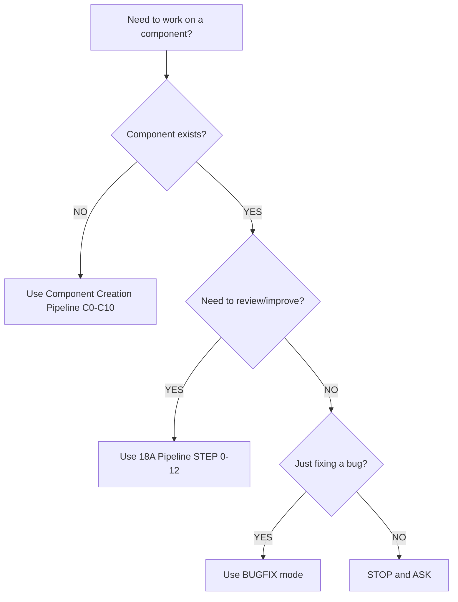

# Component Creation Pipeline (Canonical)

**Version:** 1.2  
**Date Created:** 2025-12-25  
**Last Updated:** 2025-12-25  
**Status:** ✅ **ACTIVE**  
**Layer:** UI / ARCHITECTURE  
**Priority:** CRITICAL  
**Type:** PROCESS

---

## Document Classification

**TYPE:** PROCESS  
**MUTABILITY:** EVOLVABLE  
**LOCK STATUS:** ✅ ACTIVE  
**AUTHORITY DOMAIN:** Component Creation Process

**Purpose:** This document defines the **mandatory pipeline** for creating new UI components from scratch. It is the **single source of truth** for component creation workflow and is strictly separated from component review/refactor processes.

---

## 📋 Purpose

This pipeline defines **how a new UI component must be created, validated, and registered** in the `@tenerife.music/ui` design system.

**⚠️ CRITICAL CONSTRAINT:** This pipeline is **ONLY** for **Extension Layer components**. Foundation layer is **CLOSED** and **LOCKED**. Creating new Foundation components is **FORBIDDEN**. If Foundation functionality is needed, it must go through separate architectural review and unlock procedure.

The outcome of every pipeline run:

* A new **Extension** component is **fully compliant** with all Authority Contracts
* The component is **token-driven** with no raw values
* The component is **fully tested** and **documented**
* The component is **registered** in Extension State
* Future maintenance becomes easier, not harder

### Intent

This pipeline exists to:

1. **Standardize component creation** across the entire design system
2. **Enforce Authority Contract compliance** from the start
3. **Prevent architectural drift** through structured workflow
4. **Enable AI agent execution** without interpretation
5. **Ensure predictable, high-quality outcomes** for all new components

### Non-Goals

This pipeline is **NOT**:

* A review/refactor pipeline (use [18A Component Review & Improvement Pipeline](../workflows/foundation/FOUNDATION_STEP_PIPELINE.md) for existing components)
* An audit pipeline (no audit report required)
* A migration pipeline (no legacy component migration)
* A fix pipeline (no code improvement of existing components)

**If a component already exists, use the 18A pipeline, not this one.**

---

## 🔗 Relationship to Existing Pipelines

### Component Creation Pipeline (This Document) vs 18A Pipeline

This Component Creation Pipeline is **strictly separated** from the [18A Component Review & Improvement Pipeline](../workflows/foundation/FOUNDATION_STEP_PIPELINE.md).

**When to use Component Creation Pipeline (C0-C10):**
- ✅ Creating a **new component** from scratch
- ✅ Component does **NOT exist** in the codebase
- ✅ Starting with design and building implementation
- ✅ Token mapping and API design from zero

**When to use 18A Pipeline (STEP 0-12):**
- ✅ Reviewing an **existing component**
- ✅ Refactoring/improving **existing code**
- ✅ Migrating **legacy components** to canonical form
- ✅ Creating audit reports for existing components

### Key Differences

| Aspect | Component Creation Pipeline (C0-C10) | 18A Review & Improvement Pipeline (STEP 0-12) |
|--------|-------------------------------------|------------------------------------------------|
| **Purpose** | Create new component from scratch | Review and improve existing component |
| **Input** | Design requirements, no existing code | Existing component code |
| **Phases** | DESIGN → BUILD → VALIDATE → REGISTER | ANALYZE → FIX → PROVE & LOCK |
| **Audit Report** | NO audit report required | Mandatory audit report (STEP 0-12) |
| **Code Analysis** | NO existing code to analyze | Analyze existing code (STEP 0-8) |
| **FIX Phase** | NO FIX phase (building from scratch) | FIX phase required (STEP 9) |
| **Starting Point** | Token mapping and API design | Baseline snapshot of existing code |
| **Checkpoints** | C0, C10 (minimal) | STEP 0, 8, 9, 10, 11, 12 (extensive) |

### Pipeline Selection Decision Tree

---

## 🔧 Macro Execution Model

This pipeline operates under a **four-phase execution model**.

This model does not replace the step-by-step structure below. It defines how the steps are interpreted and sequenced in practice.

### PHASE A — DESIGN & JUSTIFY (C0-C3)

**Purpose:** Design the component contract before writing any code.

During this phase:

* The component is **classified** and **justified**
* Token mapping is **designed and validated**
* Public API is **defined and documented**
* All architectural compliance is **verified upfront**

**NO code changes are allowed in this phase.**

The outcome of PHASE A is a **complete component specification** ready for implementation.

### PHASE B — BUILD (C4-C6)

**Purpose:** Implement the component following the design specification.

During this phase:

* Component scaffold is **generated**
* Token-based implementation is **built**
* Foundation composition is **applied** (if applicable)
* Internal structure and quality are **refined**

**Code changes are allowed in this phase.**

The outcome of PHASE B is a **complete component implementation** ready for validation.

### PHASE C — VALIDATE (C7-C9)

**Purpose:** Validate the implementation through stories, tests, and compliance checks.

During this phase:

* Storybook stories are **created** (Matrix, States, Sizes Gallery)
* Tests are **written** (behavior, edge cases, A11Y)
* Token compliance is **validated**

**Code changes are allowed in this phase (stories and tests only).**

The outcome of PHASE C is a **fully validated component** ready for registration.

### PHASE D — REGISTER & LOCK (C10)

**Purpose:** Register the component in the design system and lock its status.

During this phase:

* Component is **exported** from index
* Extension State is **updated**
* Project Progress is **updated**
* Lock propagation is **completed**

**NO code changes are allowed in this phase (registration only).**

The outcome of PHASE D is a **registered and locked component** ready for use.

---

## 📐 Step Execution Contract (REFERENCE)

To prevent ambiguity and execution drift, **every STEP execution** must explicitly follow the 4-phase step invariant.

### 4-Phase Step Invariant (NON-NEGOTIABLE)

Each STEP must complete **all four phases**:

1. **PREPARE** → Gather requirements and inputs for this step
2. **DECIDE** → Write decision (what we will create/build)
3. **BUILD** → Implement (only if code changes are allowed in this step)
4. **RECORD** → Document outcome and artifacts

If any phase is missing → the step is **FAILED** even if artifacts "look fine".

### Enforcement Rule

If any of the above is unclear or missing, the step is considered **not executed**, even if work was completed.

This contract exists to ensure that:

* Design, implementation, and validation are not mixed implicitly
* Assistants and tooling follow the same execution logic
* Future iterations of the pipeline remain predictable and repeatable

---

## ⚖️ Component Size & Complexity Budget (MANDATORY)

To prevent creation of unmaintainable monster components, the following limits apply:

### Size Budget

**Component Implementation (C5-C6):**
* **Maximum 500 lines** for main component file (`{ComponentName}.tsx`)
* **Maximum 200 lines** for any extracted helper file
* **Maximum 1000 lines total** for all implementation files combined

**If budget exceeded:**
* Component is too complex → Split into smaller components
* Extract subcomponents into separate files
* Consider if this should be multiple components instead of one

### Complexity Budget

**Public API (C3):**
* **Maximum 15 public props** (excluding standard HTML attributes)
* **Maximum 5 variants** (use token-driven variants only)
* **Maximum 7 sizes** (use global size scale: xs/sm/md/lg/xl/2xl/3xl)

**State Management (C5):**
* **Maximum 5 internal state variables** (prefer derived state)
* **Maximum 3 levels of nesting** in JSX structure
* **Maximum 10 conditional branches** in render logic

**If complexity budget exceeded:**
* Component is over-engineered → Simplify
* Too many props → Consolidate or split component
* Too many states → Use derived state or context
* Too many variants → Reduce to essential variants only

### Time Budget (Per Step)

To prevent infinite loops and excessive iteration:

* **C0-C3:** Maximum 30 minutes per step (design should be fast)
* **C4:** Maximum 5 minutes (scaffold generation is automated)
* **C5-C6:** Maximum 2 hours total for implementation
* **C7:** Maximum 1 hour for all stories
* **C8:** Maximum 1 hour for all tests
* **C9:** Maximum 15 minutes for validation
* **C10:** Maximum 15 minutes for registration

**Total Pipeline Time Budget:** Maximum 6 hours for typical component

**If time budget exceeded:**
* **STOP** and reassess component complexity
* Component may need to be split into multiple simpler components
* Escalate to architectural review

### Enforcement

These budgets are **HARD LIMITS**, not suggestions. If any budget is exceeded:

1. **STOP** implementation
2. **REASSESS** component scope and design
3. **SPLIT** into smaller components if necessary
4. **ESCALATE** if architectural decision is needed

**DO NOT** proceed with oversized or over-complex components.

---

## 📘 Step-by-Step Pipeline (C0-C10)

The following steps define the **complete component creation workflow**.

---

## 📸 C0 — Authority & Lock Check

### Purpose

Verify that the component **can be created** without violating architectural constraints.

This step answers the question:

> "Are we allowed to create this component, and if so, where does it belong?"

### Allowed Actions

* ✅ Check `docs/architecture/EXTENSION_STATE.md` for component existence
* ✅ Check `docs/architecture/FOUNDATION_LOCK.md` for locked components
* ✅ Verify component name does NOT conflict with Foundation components
* ✅ Verify Extension layer is appropriate for this component
* ✅ Document authority check results

### Forbidden Actions

* ❌ NO code changes
* ❌ NO file creation
* ❌ NO implementation decisions
* ❌ NO API design
* ❌ **CRITICAL:** NO Foundation component creation (Foundation layer is CLOSED and LOCKED)

### Code Changes Allowed

**NO** — This is a verification-only step.

### Required Artifacts

* Authority check results document (inline or separate file)
* Component existence verification
* Lock status verification
* Layer appropriateness verification

### Blocking Condition

**BLOCKING:** If any of these conditions are true, the pipeline **MUST REFUSE**:

* Component already exists in the codebase
* Component name is locked in Foundation layer
* Component violates Authority Contract boundaries
* Extension layer is not appropriate for this component
* **CRITICAL:** Attempt to create new Foundation component (Foundation layer is CLOSED — use Extension layer or request architectural review)

### Exit Criteria

- [ ] Component does NOT exist in codebase
- [ ] Component is NOT locked in Foundation layer
- [ ] Component name does NOT conflict with Foundation components
- [ ] Extension layer is appropriate (verified against Extension Authority)
- [ ] Authority check results documented

### Reference

* [Extension Canonical State](./EXTENSION_STATE.md) — Single source of truth for Extension components
* [Foundation Lock](./FOUNDATION_LOCK.md) — Foundation layer lock status
* [Extension Authority Contract](./EXTENSION_AUTHORITY.md) — Extension layer boundaries

---

## 🎯 C1 — Component Classification & Justification

### Purpose

Classify the component type and document its justification.

This step answers the question:

> "What type of component is this, and why does it need to exist?"

### Allowed Actions

* ✅ Classify component as ONE of: Primitive / Control / Layout / Composite / Utility
* ✅ Write 1-2 sentence role definition
* ✅ Document justification for creation (why this component is needed)
* ✅ Identify component category (for directory structure)

### Forbidden Actions

* ❌ NO code changes
* ❌ NO implementation decisions
* ❌ NO token mapping (comes in C2)
* ❌ NO API design (comes in C3)

### Code Changes Allowed

**NO** — This is a design-only step.

### Required Artifacts

* Component classification (Primitive/Control/Layout/Composite/Utility)
* Role definition (1-2 sentences)
* Justification document (why this component is needed)
* Category identification (overlays/navigation/forms/data/etc.)

### Blocking Condition

**BLOCKING:** If any of these conditions are true, the pipeline **MUST REFUSE**:

* Component classification is ambiguous or contradictory
* Role definition is too broad or overlaps with existing components
* Justification is weak or duplicates existing functionality
* Category is unclear or violates project taxonomy

### Exit Criteria

- [ ] Component type classified (Primitive/Control/Layout/Composite/Utility)
- [ ] Role definition written (1-2 sentences, clear and narrow)
- [ ] Justification documented (why this component is needed)
- [ ] Category identified (overlays/navigation/forms/data/etc.)
- [ ] Classification matches existing project taxonomy

### Reference

* [Component Creation Checklist](../workflows/tasks/COMPONENT_CREATION_CHECKLIST.md) — Component classification guidance

---

## 🎨 C2 — Token Mapping Design

### Purpose

Design the **complete token mapping** for all visual and behavioral properties.

This step answers the question:

> "What tokens will this component use, and do they all exist?"

### Allowed Actions

* ✅ List ALL visual and behavioral props
* ✅ Map EACH prop to an existing token domain
* ✅ Document token requirements (spacing, color, radius, typography, motion, elevation, gradients, opacity)
* ✅ Verify ALL required tokens exist in token system
* ✅ Use `Responsive<T>` where responsiveness is required

### Forbidden Actions

* ❌ NO code changes
* ❌ NO implementation
* ❌ NO new token creation (if token doesn't exist, STOP and request new task)
* ❌ NO raw values
* ❌ NO arbitrary token extensions

### Code Changes Allowed

**NO** — This is a design-only step.

### Required Artifacts

**CRITICAL: Artifact Format & Location (NON-NEGOTIABLE):**

All C2 artifacts MUST be documented in **ONE** of the following locations:
1. **Inline in task description/PR description** (for simple components with < 10 props)
2. **Markdown table in PR description** (for components with 10-20 props)
3. **Separate markdown file:** `docs/design/{ComponentName}_TOKEN_MAPPING.md` (for complex components with > 20 props)

**Required artifact structure:**

* **Token mapping table** (prop → token domain):
  - Format: Markdown table with columns: `Prop Name | Token Domain | Token Type | Responsive? | Notes`
  - Example: `padding | spacing | SpacingToken | Yes (sm/md/lg) | Uses semanticSpacing.md`
* **Token requirements document:**
  - List ALL token domains used (Foundation tokens: spacing, color, radius, typography, motion, elevation, gradients, opacity)
  - List Shared Component Tokens used (if applicable: ICON_TOKENS, FORM_TOKENS, etc.)
  - Verify each token exists in `src/FOUNDATION/tokens/` or `src/tokens/components/`
* **Token existence verification:**
  - Explicit statement: "All required tokens verified to exist in token system"
* **Responsive token identification:**
  - List which props use `Responsive<T>` and why

### Blocking Condition

**BLOCKING:** If any of these conditions are true, the pipeline **MUST STOP**:

* Required token does NOT exist in token system
* Token mapping is incomplete
* Raw values are proposed instead of tokens
* Token domains are ambiguous or conflicting

**Action on BLOCKING:** Request a **separate task** for token creation, then restart this pipeline.

### Exit Criteria

- [ ] ALL visual/behavioral props listed
- [ ] EACH prop mapped to existing token domain
- [ ] Token requirements documented (Foundation tokens: spacing/color/radius/typography/motion/elevation/gradients/opacity, Shared Component Tokens if applicable)
- [ ] ALL required tokens verified to exist
- [ ] `Responsive<T>` usage identified where needed
- [ ] NO raw values in mapping
- [ ] NO new tokens created

### Reference

* [Token Authority](./TOKEN_AUTHORITY.md) — Token system structure and domain hierarchy
* [Authority Navigation](./AUTHORITY_NAVIGATION.md) — Map of all Authority Contracts
* [Spacing Authority](./SPACING_AUTHORITY.md) — Spacing tokens
* [Radius Authority](./RADIUS_AUTHORITY.md) — Border radius tokens
* [Typography Authority](./TYPOGRAPHY_AUTHORITY.md) — Typography tokens
* [Motion Authority](./MOTION_AUTHORITY.md) — Motion tokens
* [Elevation Authority](./ELEVATION_AUTHORITY.md) — Elevation tokens
* [State Authority](./STATE_AUTHORITY.md) — State representation

---

## 📚 C3 — API Design & Contract Definition

### Purpose

Define the **complete public API contract** before implementation.

This step answers the question:

> "What is the public API surface, and how will developers use this component?"

### Allowed Actions

* ✅ Define public props (minimal and explicit)
* ✅ Define types (exported explicitly)
* ✅ Document API contract
* ✅ Define variants (must use global variant dictionary)
* ✅ Define sizes (must use global size scale: xs/sm/md/lg/xl/2xl/3xl)
* ✅ Document size mapping table (if component has `size` prop)
* ✅ Document prop descriptions and examples
* ✅ Verify API complies with Authority Contracts

### Forbidden Actions

* ❌ NO code changes
* ❌ NO implementation
* ❌ NO boolean style toggles without token backing
* ❌ NO variant enums without token backing (e.g., `variant: "primary" | "secondary"` requires token support)
* ❌ NO invented size or variant names (must use global canonical dictionary)
* ❌ NO `className` or `style` props (if Foundation component)

### Code Changes Allowed

**NO** — This is a design-only step.

### Required Artifacts

**CRITICAL: Artifact Format & Location (NON-NEGOTIABLE):**

All C3 artifacts MUST be documented in **ONE** of the following locations:
1. **Inline in task description/PR description** (for simple components with < 5 props)
2. **Markdown document in PR description** (for components with 5-15 props)
3. **Separate markdown file:** `docs/design/{ComponentName}_API_CONTRACT.md` (for complex components with > 15 props)

**Required artifact structure:**

* **Public props definition:**
  - Format: TypeScript interface or type definition
  - Example: `interface MyComponentProps { variant: VariantToken; size: SizeToken; }`
* **Type definitions (exported types):**
  - List ALL exported types
  - Include prop types, variant unions, size unions
* **API contract document:**
  - Component purpose (1-2 sentences)
  - Public props with descriptions
  - Default values for optional props
  - Usage examples (2-3 code snippets)
* **Variant definition (if applicable):**
  - MUST use global variant dictionary (from VARIANTS_SIZE_CANON.md)
  - List allowed variants and their token mappings
* **Size definition (if applicable):**
  - MUST use global size scale: xs/sm/md/lg/xl/2xl/3xl
  - Document which sizes are supported and why
* **Size mapping table (if component has `size` prop):**
  - MUST document size-to-token mapping using SIZE_MAPPING_SPEC template
  - MUST include all mandatory mapping keys (heightToken, paddingXToken, paddingYToken, textToken, radiusToken, gapToken, iconSizeToken, minWidthToken, hitAreaToken, maxWidthToken)
  - MUST use token references only (no raw values)
  - MUST document supported sizes subset
  - Reference: [Size Mapping Spec Authority](./SIZE_MAPPING_SPEC.md) for template and requirements
* **Prop descriptions and JSDoc examples:**
  - Each prop MUST have JSDoc comment
  - At least 1 usage example per prop

### Blocking Condition

**BLOCKING:** If any of these conditions are true, the pipeline **MUST REFUSE**:

* API design violates Authority Contract
* Props are not minimal or explicit
* Boolean style toggles exist without token backing
* Variant enums exist without token backing
* Invented size or variant names (not in global dictionary)
* `className` or `style` props in Foundation component API

**Action on BLOCKING:** Revise API design to comply with Authority Contracts, then proceed.

### Exit Criteria

- [ ] Public props defined (minimal and explicit)
- [ ] Types defined (exported explicitly)
- [ ] API contract documented
- [ ] Variants use global variant dictionary (if applicable)
- [ ] Sizes use global size scale (if applicable)
- [ ] Size mapping table documented (if component has `size` prop)
- [ ] Size mapping table follows SIZE_MAPPING_SPEC template
- [ ] All mandatory mapping keys present in size mapping table
- [ ] NO boolean style toggles without token backing
- [ ] NO variant enums without token backing
- [ ] NO invented size or variant names
- [ ] NO `className` or `style` props (if Foundation component)
- [ ] API complies with all Authority Contracts

### Reference

* [Variants & Size Canon Authority](./VARIANTS_SIZE_CANON.md) — Global size scale and variant naming dictionary
* [Size Mapping Spec Authority](./SIZE_MAPPING_SPEC.md) — Size-to-token mapping contract and template
* [Extension Authority Contract](./EXTENSION_AUTHORITY.md) — Extension API rules
* [Foundation Lock](./FOUNDATION_LOCK.md) — Foundation Enforcement rules

---

## 🛠️ C4 — Component Scaffold Generation

### Purpose

Generate the **component scaffold** using the CLI tool.

This step answers the question:

> "What is the initial file structure and boilerplate for this component?"

### Allowed Actions

* ✅ Run scaffold generator: `pnpm run component:generate -- <ComponentName> [--category <category>]`
* ✅ Verify all scaffold files created successfully
* ✅ Review generated scaffold structure
* ✅ Confirm generated code follows project patterns

### Forbidden Actions

* ❌ NO manual file creation (use scaffold generator)
* ❌ NO implementation yet (scaffold only)
* ❌ NO token implementation yet (comes in C5)
* ❌ NO Foundation composition yet (comes in C6)

### Code Changes Allowed

**YES** — This is the **FIRST step** where code changes are allowed (scaffold generation only).

### Required Artifacts

* `{ComponentName}.tsx` — Main component file
* `{ComponentName}.stories.tsx` — Storybook stories file
* `{ComponentName}.test.tsx` — Test file
* `{ComponentName}.index.ts` — Export file
* Scaffold placed in correct directory: `src/COMPOSITION/{categoryDir}/{ComponentName}/`

### Blocking Condition

**BLOCKING:** If any of these conditions are true, the pipeline **MUST STOP**:

* Scaffold generator fails
* Required files not created
* Files placed in wrong directory
* Generated code does not follow project patterns
* **Category not supported by scaffold generator** (check supported categories: overlays, navigation, forms, data, layout, composite)

**Action on BLOCKING:** 
* If scaffold generator fails: Fix generator script or use fallback
* If category not supported: Use **default category: `composite`** and place in `src/COMPOSITION/overlays/` (most common fallback)
* If files not created: Retry scaffold generation with corrected parameters
* If directory wrong: Move files to correct location manually and update imports

**Fallback Rule:** If scaffold generator cannot determine correct directory, use `src/COMPOSITION/overlays/` as default location.

### Exit Criteria

- [ ] Scaffold generator executed successfully
- [ ] `{ComponentName}.tsx` created
- [ ] `{ComponentName}.stories.tsx` created
- [ ] `{ComponentName}.test.tsx` created
- [ ] `{ComponentName}.index.ts` created
- [ ] Component placed in correct directory: `src/COMPOSITION/{categoryDir}/{ComponentName}/`
- [ ] Generated scaffold structure reviewed and approved

### Reference

* [Component Creation Checklist](../workflows/tasks/COMPONENT_CREATION_CHECKLIST.md) — Scaffold generation guidance
* Scaffold Generator Script: `scripts/generate-extension-component.ts`

---

## 🔨 C5 — Token-Based Implementation

### Purpose

Implement the **complete component logic** using token unions exclusively.

This step answers the question:

> "How do we build the component implementation following the token mapping design?"

### Allowed Actions

* ✅ Implement component logic
* ✅ Use token unions exclusively (no raw values)
* ✅ Use `Responsive<T>` where needed
* ✅ Use CSS variables via token system
* ✅ Follow CVA pattern for variants (if applicable)
* ✅ Implement state handling (if applicable)

### Forbidden Actions

* ❌ NO raw values (colors, spacing, sizes, etc.)
* ❌ NO hardcoded Tailwind utilities for visual properties
* ❌ NO raw CSS values
* ❌ NO new token creation
* ❌ NO Foundation bypass (use Foundation components)
* ❌ NO Radix primitives directly (use Foundation components)

### Code Changes Allowed

**YES** — Implementation changes are allowed in this step.

### Required Artifacts

* Complete component implementation
* Token-based styling (no raw values)
* CVA variant implementation (if applicable)
* State handling implementation (if applicable)

### Blocking Condition

**BLOCKING:** If any of these conditions are true, the pipeline **MUST STOP**:

* Raw values used in implementation
* Token mapping design (C2) not followed
* API contract (C3) not followed
* Required tokens do not exist

**Action on BLOCKING:** Fix implementation to follow token mapping and API contract, then proceed.

### Exit Criteria

- [ ] Component logic implemented
- [ ] Token unions used exclusively (no raw values)
- [ ] `Responsive<T>` used where needed
- [ ] CSS variables via token system
- [ ] CVA pattern followed (if applicable)
- [ ] State handling implemented (if applicable)
- [ ] **SELF-CHECK:** Quick scan for raw values (colors like `#hex`, spacing like `16px`, sizes like `1rem`, gradients like `linear-gradient(...)`, opacity like `0.5`) — MUST be ZERO raw values before proceeding
- [ ] **SELF-CHECK:** Verify C2 token mapping followed (compare implementation against C2 token mapping table)
- [ ] **SELF-CHECK:** Verify C3 API contract followed (compare implementation against C3 public props definition)
- [ ] NO raw values in implementation
- [ ] Token mapping design (C2) followed
- [ ] API contract (C3) followed

**⚠️ CRITICAL:** If self-checks fail, FIX immediately before proceeding to C6. Do NOT defer token compliance to C9.

### Reference

* [Token Mapping Design (C2)](#c2--token-mapping-design) — Token requirements
* [API Design & Contract (C3)](#c3--api-design--contract-definition) — Public API contract

---

## 🧩 C6 — Implementation Refinement

### Purpose

Refine the component implementation through Foundation composition (if applicable) and code quality improvements.

This step answers the question:

> "Does this component use Foundation correctly, and is the code clean and maintainable?"

---

### Sub-Section 1: Foundation Composition (If Applicable)

#### Applicability Decision Criteria (MANDATORY)

**This sub-section is APPLICABLE if ANY of the following are true:**
* Component needs modal/dialog behavior → MUST use Foundation Modal
* Component needs tabs behavior → MUST use Foundation Tabs
* Component needs select/dropdown behavior → MUST use Foundation Select
* Component needs button behavior → MUST use Foundation Button
* Component needs link/navigation behavior → MUST use Foundation Link
* Component needs overlay behavior → Check if Foundation Popover/Tooltip/HoverCard is appropriate
* Component needs contextual menu → MUST use Foundation ContextMenu

**This sub-section is NOT APPLICABLE if ALL of the following are true:**
* Component is a pure layout primitive (Box/Stack/Grid extension)
* Component is a pure visual primitive (Badge/Icon/Divider)
* Component is a pure form input (Input/Textarea/Checkbox/Radio without composition)
* Component has NO interactive behavior requiring Foundation primitives

**When in doubt:** This sub-section is APPLICABLE. Use Foundation components unless explicitly justified otherwise.

#### Allowed Actions

* ✅ Use Foundation components internally (Modal, Tabs, Select, Button, Link, etc.)
* ✅ Use Foundation public APIs only
* ✅ Treat Foundation components as black boxes
* ✅ Compose Foundation components to build higher-level functionality

#### Forbidden Actions

* ❌ NO Foundation bypass (use Foundation components, not Radix directly)
* ❌ NO Foundation duplication (don't reimplement Foundation behavior)
* ❌ NO Foundation internal API access
* ❌ NO direct Radix primitive usage (use Foundation wrappers)

---

### Sub-Section 2: Code Quality & Structure (Always Required)

#### Allowed Actions

* ✅ Readability refactors
* ✅ Extract helpers or subcomponents (if needed)
* ✅ Add JSDoc comments (component, props, examples)
* ✅ Improve naming and structure
* ✅ Remove code duplication
* ✅ Simplify conditional logic

#### Forbidden Actions

* ❌ NO behavior changes
* ❌ NO API changes
* ❌ NO token changes
* ❌ NO new features

---

### Code Changes Allowed

**YES** — Composition and quality improvement changes are allowed in this step.

### Required Artifacts

* Foundation composition implementation (if applicable)
* Foundation public API usage (if applicable)
* Refined component implementation
* JSDoc comments (component description, props descriptions, examples)
* Extracted helpers (if needed)
* Clean and readable code

### Blocking Condition

**BLOCKING:** If any of these conditions are true, the pipeline **MUST STOP**:

* Foundation bypass detected (using Radix directly instead of Foundation components)
* Foundation duplication detected (reimplementing Foundation behavior)
* Foundation internal API access detected
* Code quality is poor (unreadable, unmaintainable)
* JSDoc comments are missing or incomplete
* Code duplication is excessive
* Naming is unclear or misleading

**Action on BLOCKING:** Fix composition and/or refactor for quality and clarity, then proceed.

### Exit Criteria

**Foundation Composition (if applicable):**
- [ ] Foundation components used internally (if applicable)
- [ ] Foundation public APIs used only
- [ ] Foundation components treated as black boxes
- [ ] NO Foundation bypass
- [ ] NO Foundation duplication
- [ ] NO Foundation internal API access
- [ ] NO direct Radix primitive usage

**Code Quality & Structure (always required):**
- [ ] Code is clean and readable
- [ ] JSDoc comments added (component, props, examples)
- [ ] Helpers extracted (if needed)
- [ ] Naming is clear and consistent
- [ ] Code duplication removed
- [ ] Conditional logic simplified
- [ ] NO behavior changes
- [ ] NO API changes
- [ ] NO token changes

**Note:** If this component does NOT compose Foundation components, mark Foundation Composition criteria as N/A and proceed.

### Reference

* [Extension Canonical State](./EXTENSION_STATE.md) — Foundation components available for composition
* [Extension Authority Contract](./EXTENSION_AUTHORITY.md) — Extension composition rules
* [Foundation Lock](./FOUNDATION_LOCK.md) — Foundation component status
* TypeScript strict mode compliance required
* Project code style and conventions followed

---

## 📖 C7 — Storybook Stories

### Purpose

Create **complete Storybook stories** to demonstrate component usage.

This step answers the question:

> "How do we demonstrate all component variants, sizes, states, and use cases?"

### Allowed Actions

* ✅ Create Default story (basic usage)
* ✅ Create Matrix story (if component has BOTH `size` AND `variant` props)
* ✅ Create States story (if component has public state props: disabled, loading, error, etc.)
* ✅ Create Sizes Gallery (if component has `size` prop)
* ✅ Create Long Content story (if overlay component)
* ✅ Create use case examples (**MINIMUM 2, MAXIMUM 5** real-world usage scenarios)
* ✅ Demonstrate token usage (at least 1 story showing responsive token usage)

### Forbidden Actions

* ❌ NO placeholder stories
* ❌ NO incomplete stories
* ❌ NO component implementation changes (stories only)

### Code Changes Allowed

**YES** — Story file changes are allowed in this step (`.stories.tsx` only).

### Required Artifacts

* Default story (basic usage)
* Matrix story (if `size` AND `variant` props exist)
* States story (if public state props exist)
* Sizes Gallery (if `size` prop exists)
* Long Content story (if overlay component)
* Use case examples

### Blocking Condition

**BLOCKING:** If any of these conditions are true, the pipeline **MUST STOP**:

* Required stories are missing
* Stories are placeholder or incomplete
* Matrix story missing (if `size` AND `variant` props exist)
* States story missing (if public state props exist)
* Sizes Gallery missing (if `size` prop exists)

**Action on BLOCKING:** Complete all required stories, then proceed.

### Exit Criteria

- [ ] Default story created
- [ ] Matrix story created (if component has BOTH `size` AND `variant` props)
- [ ] States story created (if component has public state props)
- [ ] Sizes Gallery created (if component has `size` prop)
- [ ] Long Content story created (if overlay component)
- [ ] Use case examples included
- [ ] Token usage demonstrated
- [ ] NO placeholder stories
- [ ] NO incomplete stories

### Reference

* [Variants & Size Canon Authority](./VARIANTS_SIZE_CANON.md) — Matrix and States story requirements
* [Size Mapping Spec Authority](./SIZE_MAPPING_SPEC.md) — Sizes Gallery and Long Content story requirements

---

## ✅ C8 — Tests

### Purpose

Write **comprehensive tests** to verify component behavior.

This step answers the question:

> "How do we prove that the component works correctly?"

### Allowed Actions

* ✅ Write behavior tests (public props and their interactions)
* ✅ Write edge case tests
* ✅ Write A11Y tests (if interactive component)
* ✅ Write token compliance tests
* ✅ Test ARIA roles and attributes (if interactive)
* ✅ Test keyboard navigation (if interactive)
* ✅ Test focus management (if interactive)

### Forbidden Actions

* ❌ NO placeholder tests
* ❌ NO shallow tests
* ❌ NO component implementation changes (tests only)

### Code Changes Allowed

**YES** — Test file changes are allowed in this step (`.test.tsx` only).

### Required Artifacts

* Behavior tests (public props and their interactions)
* Edge case tests
* A11Y tests (if interactive component)
* Token compliance tests

### Blocking Condition

**BLOCKING:** If any of these conditions are true, the pipeline **MUST STOP**:

* Required tests are missing
* Tests are placeholder or shallow
* A11Y tests missing (if interactive component)
* Token compliance tests missing

**Action on BLOCKING:** Complete all required tests, then proceed.

### Exit Criteria

- [ ] Behavior tests written (public props and their interactions)
- [ ] Edge case tests written
- [ ] A11Y tests written (if interactive component)
- [ ] Token compliance tests written
- [ ] ARIA roles and attributes tested (if interactive)
- [ ] Keyboard navigation tested (if interactive)
- [ ] Focus management tested (if interactive)
- [ ] NO placeholder tests
- [ ] NO shallow tests

### Reference

* [Component Creation Checklist](../workflows/tasks/COMPONENT_CREATION_CHECKLIST.md) — Test coverage requirements

---

## 🔍 C9 — Token Compliance Validation

### Purpose

Validate that the **entire component** is token-compliant with NO raw values.

This step answers the question:

> "Is the component fully token-driven with zero raw values?"

### Allowed Actions

* ✅ Scan component code for raw values
* ✅ Verify all visual props use token unions
* ✅ Verify `Responsive<T>` usage where needed
* ✅ Verify token mapping design (C2) was followed
* ✅ Document compliance verification results

### Forbidden Actions

* ❌ NO code changes (validation only)
* ❌ NO implementation fixes (if compliance fails, return to C5)

### Code Changes Allowed

**NO** — This is a validation-only step.

### Required Artifacts

* Token compliance verification results
* Raw values scan results
* Token union verification results
* `Responsive<T>` verification results

### Blocking Condition

**BLOCKING:** If any of these conditions are true, the pipeline **MUST STOP**:

* Raw values detected in component code
* Token unions not used for visual props
* `Responsive<T>` not used where needed
* Token mapping design (C2) not followed

**Action on BLOCKING:** Return to C5 (Token-Based Implementation), fix implementation, then retry C9.

**⚠️ CRITICAL - RETRY LIMIT:** Maximum 3 attempts at C9 validation. If compliance fails after 3 attempts:
1. **STOP** the pipeline
2. **ESCALATE** to human review
3. **DOCUMENT** why compliance cannot be achieved
4. **REQUEST** separate task for compliance fixes or architectural review

**DO NOT** loop indefinitely between C5 and C9.

### Exit Criteria

- [ ] NO raw values in component code
- [ ] All visual props use token unions
- [ ] `Responsive<T>` used where needed
- [ ] Token mapping design (C2) followed
- [ ] Compliance verification results documented

### Reference

* [Token Mapping Design (C2)](#c2--token-mapping-design) — Original token requirements
* [Authority Navigation](./AUTHORITY_NAVIGATION.md) — All Authority Contracts

---

## 🔒 C10 — Export Registration & Lock Propagation

### Purpose

Register the component in the design system and lock its status.

This step answers the question:

> "How do we officially register this component and make it available for use?"

### Allowed Actions

**CRITICAL: Execute in EXACT ORDER (NON-NEGOTIABLE):**

1. ✅ **First:** Export component from `src/index.ts` (verify export works, no type errors)
2. ✅ **Second:** Export types from `src/index.ts` (verify types exported correctly)
3. ✅ **Third:** Update `docs/architecture/EXTENSION_STATE.md` (add component to ALLOWED section)
4. ✅ **Fourth:** Update `docs/PROJECT_PROGRESS.md` (record completion)
5. ✅ **Fifth:** Document lock propagation completion

**Rationale:** Export first to verify component is valid. If export fails, documentation remains clean. If documentation updated first and export fails, documentation becomes inconsistent with codebase.

### Forbidden Actions

* ❌ NO code changes (registration only)
* ❌ NO implementation changes
* ❌ NO story changes
* ❌ NO test changes

### Code Changes Allowed

**NO** — This is a registration-only step (export and documentation updates only).

### Required Artifacts

* Component exported from `src/index.ts`
* Types exported from `src/index.ts`
* `docs/architecture/EXTENSION_STATE.md` updated
* `docs/PROJECT_PROGRESS.md` updated
* Lock propagation documentation

### Blocking Condition

**BLOCKING:** If any of these conditions are true, the pipeline **MUST STOP**:

* Export fails (missing files, type errors)
* EXTENSION_STATE.md update fails
* PROJECT_PROGRESS.md update fails
* Lock propagation incomplete

**Action on BLOCKING:** Fix export or documentation issues, then retry C10.

### Exit Criteria

- [ ] Component exported from `src/index.ts`
- [ ] Types exported from `src/index.ts`
- [ ] `docs/architecture/EXTENSION_STATE.md` updated (component added to ALLOWED section)
- [ ] `docs/PROJECT_PROGRESS.md` updated (completion recorded)
- [ ] Lock propagation completed
- [ ] Component is officially registered and available for use

**For Foundation components** (rare for new components):
- [ ] `docs/architecture/FOUNDATION_LOCK.md` updated
- [ ] `docs/architecture/ARCHITECTURE_LOCK.md` updated

### Reference

* [Extension Canonical State](./EXTENSION_STATE.md) — Extension component registry
* [Project Progress](../PROJECT_PROGRESS.md) — Project tracking

---

## 🚫 Blocking & Gating Rules

### Blocking Conditions

The following conditions **BLOCK** pipeline progress and require immediate action:

**C0 Blockers:**
* Component already exists → **REFUSE pipeline, use 18A instead**
* Component is locked in Foundation → **REFUSE pipeline**
* Extension layer not appropriate → **REFUSE pipeline**

**C2 Blockers:**
* Required token doesn't exist → **STOP, request token creation task**

**C3 Blockers:**
* API design violates Authority → **REFUSE pipeline**

**C9 Blockers:**
* Token compliance fails → **STOP, return to C5 and fix implementation**

### Gating Rule

**Cannot proceed to CN+1 unless CN is complete.**

All exit criteria for step CN must be met before proceeding to step CN+1.

### Failure Mode: Token Creation Required

If step C2 discovers that required tokens do NOT exist:

1. **STOP** the Component Creation Pipeline
2. **REQUEST** a separate task for token creation
3. **WAIT** for token creation to complete
4. **RESTART** Component Creation Pipeline from C0

**DO NOT** create tokens as part of this pipeline.

### Failure Mode: Rollback & Cleanup

If pipeline fails at any step after C4 (scaffold generation), cleanup is required to prevent orphaned files.

**Rollback Procedure:**

**If failure occurs at C5-C6 (implementation):**
1. Delete generated scaffold files
2. Remove component directory
3. **DO NOT** update documentation (nothing was registered yet)

**If failure occurs at C7-C8 (validation):**
1. Keep implementation files (may be salvageable)
2. Delete incomplete story/test files
3. **DO NOT** update documentation (nothing was registered yet)
4. Option: Complete stories/tests manually or restart from C7

**If failure occurs at C9 (token compliance):**
1. If compliance fails after 3 retry attempts → ESCALATE
2. Keep all files (implementation, stories, tests)
3. **DO NOT** update documentation (component not compliant yet)
4. **DO NOT** export component (not ready for use)
5. Mark component as "In Progress - Compliance Issues" in PROJECT_PROGRESS.md

**If failure occurs at C10 (export/registration):**
1. If export fails: Fix type errors, retry export
2. If documentation update fails: Component already exported (partial state)
3. Rollback export if documentation cannot be updated
4. Never leave component exported but undocumented

**General Rule:** If pipeline fails, clean up to previous stable state. Do NOT leave half-completed components in codebase.

---

## 📄 Artifact & Reporting Rules

### NO Audit Report Required

Unlike the 18A Component Review & Improvement Pipeline, this Component Creation Pipeline does **NOT** require a continuous audit report.

**Why no audit report:**
* We are creating from scratch, not auditing existing code
* Design specification (C0-C3) serves as the "baseline"
* Validation (C8-C10) serves as the "proof"
* No FIX phase or refactor decisions to track

### Required Artifacts per Step

**C0: Authority & Lock Check**
* Authority check results document

**C1: Component Classification & Justification**
* Classification document
* Role definition
* Justification document

**C2: Token Mapping Design**
* Token mapping table
* Token requirements document

**C3: API Design & Contract Definition**
* Public API contract document
* Type definitions

**C4: Component Scaffold Generation**
* Scaffold files (`.tsx`, `.stories.tsx`, `.test.tsx`, `index.ts`)

**C5: Token-Based Implementation**
* Component implementation files

**C6: Implementation Refinement**
* Foundation composition implementation (if applicable)
* Refined implementation
* JSDoc comments

**C7: Storybook Stories**
* Story files (`.stories.tsx`)

**C8: Tests**
* Test files (`.test.tsx`)

**C9: Token Compliance Validation**
* Compliance verification results

**C10: Export Registration & Lock Propagation**
* Export updates (`src/index.ts`)
* Documentation updates (`EXTENSION_STATE.md`, `PROJECT_PROGRESS.md`)

### Reporting

**Final Reporting (C10):**
* Update `docs/PROJECT_PROGRESS.md` with completion record
* Include: component name, date, pipeline version, completion status

**NO intermediate reporting required** (unlike 18A checkpoints).

---

## 🔐 Lock & Registration Rules

### Lock Propagation (C10)

**For Extension components** (most common):

**Required updates:**
1. Export component and types from `src/index.ts`
2. Update `docs/architecture/EXTENSION_STATE.md`:
   * Add component to ALLOWED section
   * Include component path, exports, and status
3. Update `docs/PROJECT_PROGRESS.md`:
   * Record component creation completion
   * Include date, pipeline version

**For Foundation components** (rare for new components):

**Required updates:**
1. Export component and types from `src/index.ts`
2. Update `docs/architecture/FOUNDATION_LOCK.md`:
   * Add component to locked components list
   * Include lock date, lock report path
3. Update `docs/architecture/ARCHITECTURE_LOCK.md`:
   * Record architectural decisions
4. Update `docs/PROJECT_PROGRESS.md`:
   * Record component creation completion

### Lock Status

**After C10 completion:**
* Extension components are **ALLOWED** (not locked)
* Foundation components are **LOCKED** (if explicitly locked)
* Component is **registered** and **available for use**
* Component is **ready for consumption** in applications

---

## 🎯 Explicit Non-Goals

### This Pipeline is NOT

* ❌ A review pipeline → Use [18A Component Review & Improvement Pipeline](../workflows/foundation/FOUNDATION_STEP_PIPELINE.md)
* ❌ An audit pipeline → Use 18A for auditing existing components
* ❌ A refactoring pipeline → Use 18A for refactoring existing components
* ❌ A migration pipeline → Use 18A for migrating legacy components
* ❌ A fix pipeline → Use 18A for fixing existing components

### This Pipeline DOES NOT

* ❌ Analyze existing code → No existing code to analyze
* ❌ Apply fixes to existing components → Use 18A for fixes
* ❌ Create audit reports → No audit report required
* ❌ Refactor existing implementations → Use 18A for refactoring
* ❌ Migrate legacy components → Use 18A for migration
* ❌ Review existing component quality → Use 18A for review
* ❌ **CRITICAL:** Create Foundation components → Foundation layer is CLOSED and LOCKED (use Extension layer only)

### This Pipeline IS

* ✅ A creation-only pipeline (11 steps: C0-C10)
* ✅ For building new components from scratch
* ✅ Token-driven and Authority-compliant from the start
* ✅ Executable by AI agents without interpretation
* ✅ Design-first (PHASE A) before implementation (PHASE B)
* ✅ Validation-driven (PHASE C) before registration (PHASE D)

### When to Use This Pipeline vs 18A

**Use Component Creation Pipeline (C0-C10) when:**
* ✅ Component does NOT exist
* ✅ Starting from design and requirements
* ✅ Building token-driven implementation from scratch

**Use 18A Pipeline (STEP 0-12) when:**
* ✅ Component ALREADY exists
* ✅ Need to review, audit, or improve existing code
* ✅ Need to migrate legacy component to canonical form
* ✅ Need to refactor existing implementation

**Rule:** If a component already exists, use 18A. If it doesn't exist, use this pipeline.

---

## 📚 Related Documents

### Authority Contracts

* [Authority Navigation](./AUTHORITY_NAVIGATION.md) — Map of all Authority Contracts
* [Extension Authority Contract](./EXTENSION_AUTHORITY.md) — Extension layer boundaries
* [Spacing Authority](./SPACING_AUTHORITY.md) — Spacing tokens
* [Radius Authority](./RADIUS_AUTHORITY.md) — Border radius tokens
* [Typography Authority](./TYPOGRAPHY_AUTHORITY.md) — Typography tokens
* [Motion Authority](./MOTION_AUTHORITY.md) — Motion tokens
* [Elevation Authority](./ELEVATION_AUTHORITY.md) — Elevation tokens
* [State Authority](./STATE_AUTHORITY.md) — State representation
* [Variants & Size Canon Authority](./VARIANTS_SIZE_CANON.md) — Global size scale and variant naming dictionary
* [Size Mapping Spec Authority](./SIZE_MAPPING_SPEC.md) — Size-to-token mapping contract

### Lock & State Documents

* [Foundation Lock](./FOUNDATION_LOCK.md) — Foundation layer lock status
* [Extension Canonical State](./EXTENSION_STATE.md) — Extension component registry
* [Architecture Lock](./ARCHITECTURE_LOCK.md) — Architectural decisions

### Process Documents

* [18A Component Review & Improvement Pipeline](../workflows/foundation/FOUNDATION_STEP_PIPELINE.md) — Pipeline for reviewing/refactoring existing components
* [Component Creation Checklist](../workflows/tasks/COMPONENT_CREATION_CHECKLIST.md) — Detailed checklist for creating Extension components
* [TUNG System Specification](../workflows/tung_system_specification.md) — Task system for AI agents

### Reference Documents

* [Project Progress](../PROJECT_PROGRESS.md) — Project tracking
* [Component Needs Inventory](../workflows/tasks/COMPONENT_NEEDS_INVENTORY.md) — Component requirements

---

## 📝 Version History

* **v1.2** (2025-12-25): Pipeline Optimization (12→11 Steps)
  * **OPTIMIZATION:** Reduced pipeline from 12 to 11 steps
  * Consolidated C6 (Foundation Composition) and C7 (Internal Structure & Quality) into single C6 (Implementation Refinement)
  * C6 now has two sub-sections: Foundation Composition (if applicable) and Code Quality & Structure (always required)
  * All subsequent steps renumbered: C8→C7, C9→C8, C10→C9, C11→C10
  * PHASE B reduced from 4 steps to 3 steps (C4-C6)
  * PHASE C steps renumbered (C7-C9)
  * PHASE D step renumbered (C10)
  * All internal references updated throughout document
  * No functional changes to step execution logic
  * All exit criteria preserved in sub-sections
  * Risk Level: LOW (safe consolidation)

* **v1.1** (2025-12-25): Critical Review & Hardening
  * **CRITICAL FIX:** Added explicit Foundation creation prohibition (Foundation CLOSED)
  * **CRITICAL FIX:** Added artifact format & location specification (C2, C3)
  * **CRITICAL FIX:** Added C10 retry limit (max 3 attempts) to prevent infinite loops
  * Added C5 self-check requirements (early token compliance validation)
  * Added C6 applicability decision criteria (explicit Foundation composition rules)
  * Added C8 use case quantity guidance (min 2, max 5 examples)
  * Added C4 fallback rule for unsupported categories
  * Added C11 explicit ordering for export/documentation updates
  * Added rollback & cleanup procedure for pipeline failures
  * Added component size & complexity budget (hard limits)
  * Added time budget per step (max 6 hours total)
  * See `COMPONENT_CREATION_PIPELINE_CRITICAL_REVIEW.md` for detailed changelog

* **v1.0** (2025-12-25): Initial Component Creation Pipeline
  * Created canonical pipeline for component creation from scratch
  * Defined 4 phases (DESIGN & JUSTIFY, BUILD, VALIDATE, REGISTER & LOCK)
  * Defined 12 steps (C0-C11)
  * Documented step execution contract (4-phase step invariant)
  * Documented blocking & gating rules
  * Documented artifact & reporting rules (no audit report)
  * Documented lock & registration rules
  * Documented explicit non-goals
  * Separated from 18A Component Review & Improvement Pipeline

---

**Status:** ✅ **ACTIVE**  
**Version:** 1.2  
**Date Created:** 2025-12-25  
**Last Updated:** 2025-12-25 (Pipeline Optimization: 12→11 Steps)  
**Priority:** CRITICAL  
**Type:** PROCESS

